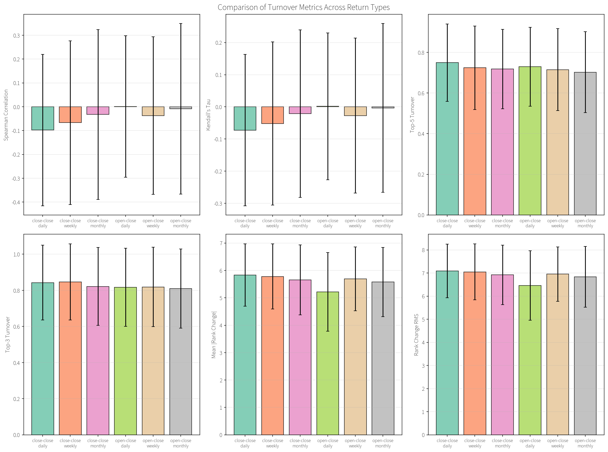
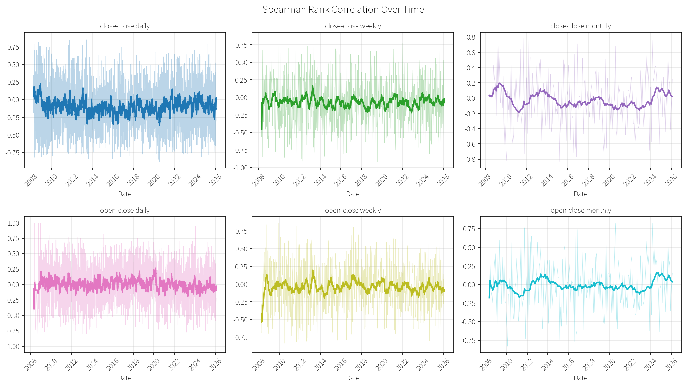
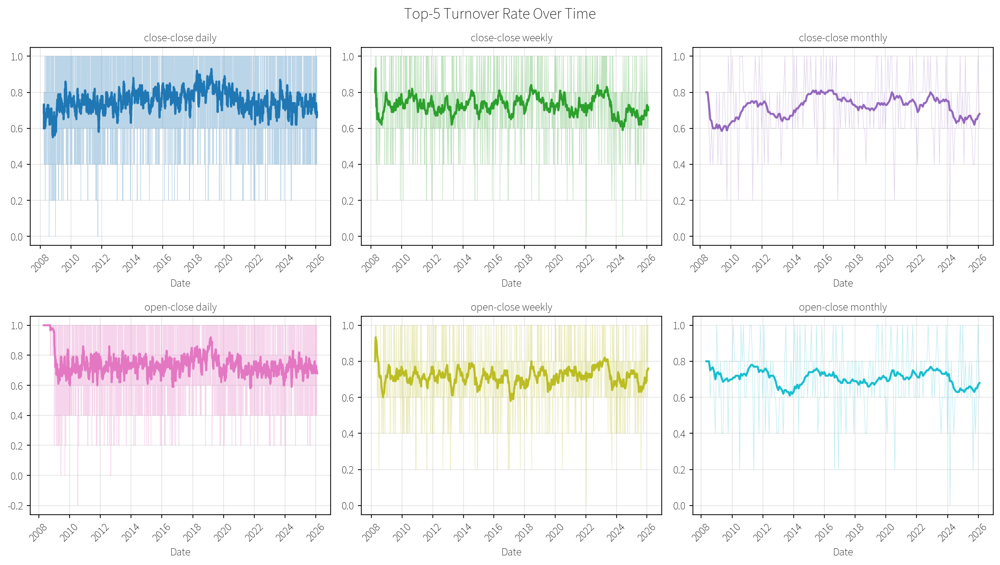
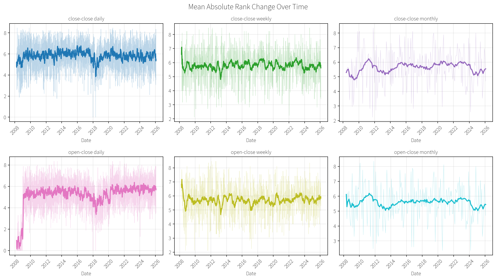
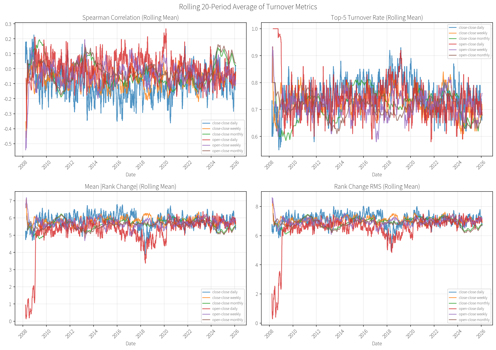
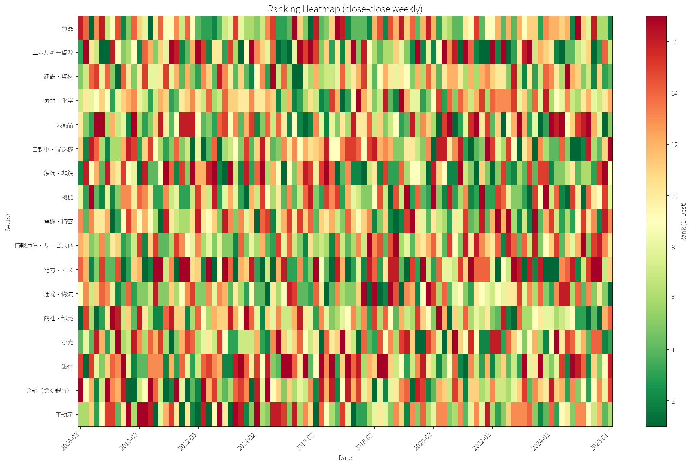
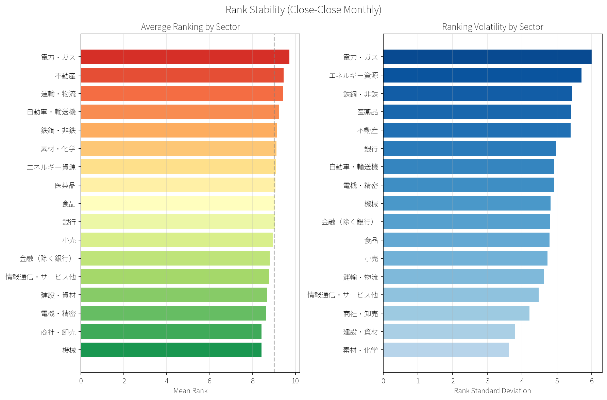
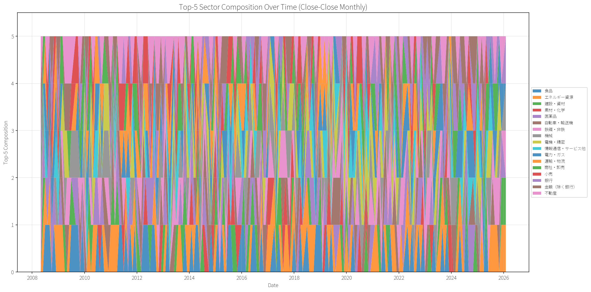

# TOPIX-17 ETF ランキング回転率分析

TOPIX-17セクターETFのリターンランキングがどの程度安定しているか（あるいは不安定か）を定量的に分析する。

## 概要

### 対象ETF

TOPIX-17業種分類に対応する17本のETF（野村アセット）:

| ティッカー | セクター |
|-----------|---------|
| 1617.T | 食品 |
| 1618.T | エネルギー資源 |
| 1619.T | 建設・資材 |
| 1620.T | 素材・化学 |
| 1621.T | 医薬品 |
| 1622.T | 自動車・輸送機 |
| 1623.T | 鉄鋼・非鉄 |
| 1624.T | 機械 |
| 1625.T | 電機・精密 |
| 1626.T | 情報通信・サービス他 |
| 1627.T | 電力・ガス |
| 1628.T | 運輸・物流 |
| 1629.T | 商社・卸売 |
| 1630.T | 小売 |
| 1631.T | 銀行 |
| 1632.T | 金融（除く銀行） |
| 1633.T | 不動産 |

### 分析シナリオ

リターン計算方法と頻度の組み合わせで6シナリオを分析:

- **リターン計算**: Close-to-Close / Open-to-Close
- **頻度**: Daily / Weekly / Monthly

### 回転率指標

| 指標 | 説明 |
|-----|------|
| Spearman順位相関 | 前期と今期のランキング間の相関（1=完全一致、-1=完全逆転） |
| Kendall's tau | 順位ペアの一致度 |
| Top-N回転率 | 上位N位の入れ替わり率（0=変化なし、1=全入替） |
| 平均順位変化 | 全セクターの平均的な順位変動幅 |
| 順位変化RMS | 順位変化の二乗平均平方根 |

---

## 結果サマリー

| シナリオ | Spearman相関(平均) | Top-5回転率(平均) | 平均順位変化 |
|----------|-------------------|-------------------|-------------|
| close-close daily | -0.098 | 0.750 | 5.83 |
| close-close weekly | -0.067 | 0.725 | 5.78 |
| close-close monthly | -0.033 | 0.718 | 5.66 |
| open-close daily | 0.001 | 0.730 | 5.21 |
| open-close weekly | -0.037 | 0.716 | 5.69 |
| open-close monthly | -0.009 | 0.703 | 5.58 |

### 主な発見

1. **ランキングに持続性がない**: Spearman相関がほぼゼロ〜マイナス → 前期のランキングは今期を予測しない
2. **Top-5は毎期大きく入れ替わる**: 回転率70%以上 → 上位5セクター中3〜4セクターが毎期入れ替わる
3. **頻度による差は小さい**: Daily/Weekly/Monthlyで大きな差がない
4. **リターン計算方法の影響も軽微**: Close-to-CloseとOpen-to-Closeで傾向は同じ

---

## 図表

### 1. 指標比較（全シナリオ）

各シナリオ間での回転率指標の比較。



### 2. 時系列分析

#### Spearman順位相関の推移



#### Top-5回転率の推移



#### 平均順位変化の推移



### 3. ローリング平均

20期間のローリング平均で回転率指標の時系列変動を可視化。



### 4. ランキングヒートマップ

#### 月次（Close-to-Close）


#### 週次（Close-to-Close）



### 5. セクター別ランキング安定性

左: 平均順位（低いほど好パフォーマンス）
右: 順位の標準偏差（低いほど安定）



**観察**:
- **機械・商社・卸売・電機・精密**: 平均順位が良好（上位に位置しやすい）
- **電力・ガス・不動産**: 平均順位が悪い（下位に位置しやすい）
- **電力・ガス・エネルギー資源**: 順位変動が大きい（不安定）
- **素材・化学・建設・資材**: 順位変動が小さい（安定）

### 6. Top-5構成の推移

月次ベースでTop-5に入るセクターの変遷。



---

## 結論

TOPIX-17セクターETFのリターンランキングは**極めて不安定**であり、前期のパフォーマンスから今期を予測することは困難。セクターローテーション戦略を検討する際は、この高い回転率を考慮する必要がある。

## 実行方法

```bash
uv run 20260126_topix17_etf_turnover/20260126_topix17_etf_turnover.py
```

初回実行時にGoogle FontsからNoto Sans JPをダウンロードし、`~/.cache/matplotlib_jp_fonts/`にキャッシュする。
