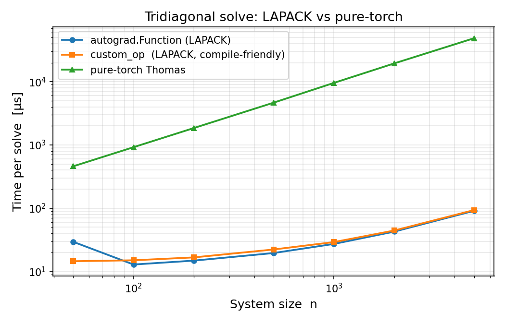

# PyTorch で custom operator / autograd を定義する方法

**Date:** 2026-04-05

## 概要

PyTorch の autograd に乗せながら LAPACK の高速ルーチンを呼び出す方法を、
三重対角連立方程式 `Ax = b` のソルバーを題材に学んだ。

実装方法は大きく 2 種類ある：

| 方法 | クラス/API | `torch.compile` 対応 |
|------|-----------|----------------------|
| **① autograd.Function** | `torch.autograd.Function` | ✗（`.numpy()` でグラフブレーク） |
| **② custom_op + register_autograd** | `torch.library.custom_op` | ✓（グラフブレークなし） |

---

## 詳細

### 題材: 三重対角ソルバー

行列 A が三重対角のとき `Ax = b` を解く。LAPACK の `?gtsv`（`s/d/c/z` で dtype 自動選択）を使えば純粋な PyTorch 実装（Thomas 法）の **300〜400 倍**速い。

```
lower  diag  upper
       d0    u0
l0     d1    u1
       ...
l_{n-2} d_{n-1}
```

#### Backward の導出

スカラー損失 `L` に対して：

```
dL/db  = A^{-T} (dL/dx)     →  A^T v = dL/dx を解く（lower/upper を入れ替えるだけ）

grad_diag [i]   = -v[i]   * x[i]
grad_upper[i]   = -v[i]   * x[i+1]
grad_lower[i]   = -v[i+1] * x[i]
grad_rhs  [i]   = v[i]
```

バッチ RHS `(n, k)` のときは上式を `k` 方向に sum する。

---

### ① `torch.autograd.Function`

```python
class _TridiagonalSolveFn(torch.autograd.Function):
    @staticmethod
    def forward(ctx, lower, diag, upper, rhs):
        x = _gtsv(lower.detach().numpy(), diag.detach().numpy(),
                  upper.detach().numpy(), rhs.detach().numpy())
        x_t = torch.tensor(x, dtype=diag.dtype)
        ctx.save_for_backward(lower, diag, upper, x_t)
        return x_t

    @staticmethod
    def backward(ctx, grad_output):
        lower, diag, upper, x = ctx.saved_tensors
        # A^T solve = swap lower/upper
        v = torch.tensor(
            _gtsv(upper.detach().numpy(), diag.detach().numpy(),
                  lower.detach().numpy(), grad_output.detach().numpy()),
            dtype=diag.dtype,
        )
        grad_diag  = -v * x
        grad_upper = -v[:-1] * x[1:]
        grad_lower = -v[1:]  * x[:-1]
        return grad_lower, grad_diag, grad_upper, v
```

**Pro**
- シンプルで直感的
- PyTorch 1.x 時代から使える枯れた API

**Con**
- `forward` / `backward` 内の `.numpy()` が `torch.compile` のトレースを中断する（グラフブレーク）
- モデル全体を compile したいときに LAPACK 呼び出しの前後でコンパイル領域が分断される

---

### ② `torch.library.custom_op` + `register_autograd`（PyTorch 2.4+）

**ポイント**: `.numpy()` を呼ぶ LAPACK カーネルを custom op として登録し、
`register_fake` で shape/dtype の推論ルールを与える。
こうすると `torch.compile` は custom op を**不透明なリーフ演算子**として扱い、
グラフブレークなしにトレースできる。

```python
# 1. forward カーネルを custom op として登録
@torch.library.custom_op("mylib::tridiagonal_solve", mutates_args=())
def _tridiagonal_solve_kernel(lower, diag, upper, rhs):
    x = _gtsv(lower.numpy(), diag.numpy(), upper.numpy(), rhs.numpy())
    return torch.tensor(x, dtype=diag.dtype)

# 2. tracing 用の fake (shape/dtype だけ返す)
@_tridiagonal_solve_kernel.register_fake
def _(lower, diag, upper, rhs):
    return rhs.new_empty(rhs.shape)

# 3. context 保存
def _setup_context(ctx, inputs, output):
    lower, diag, upper, _ = inputs
    ctx.save_for_backward(lower, diag, upper, output)

# 4. backward — 同じ custom op を lower/upper 入れ替えで再利用
def _backward(ctx, grad_output):
    lower, diag, upper, x = ctx.saved_tensors
    v = _tridiagonal_solve_kernel(upper, diag, lower, grad_output)  # A^T solve
    grad_lower, grad_diag, grad_upper = _compute_grads(v, x)
    return grad_lower, grad_diag, grad_upper, v

torch.library.register_autograd(
    "mylib::tridiagonal_solve", _backward, setup_context=_setup_context
)
```

**backward でも custom op を再利用する**のがポイント。
backward の中で `.numpy()` を直接呼ぶと AOT autograd がトレース時にエラーを出す。

**Pro**
- `torch.compile` でグラフブレークなし（`graph breaks: 0` を確認済み）
- `sgtsv / dgtsv / cgtsv / zgtsv` を `get_lapack_funcs` で dtype 自動選択
- バッチ RHS `(n, k)` もそのまま動く
- `gradcheck` も通る

**Con**
- PyTorch 2.4+ が必要
- `register_fake` を書き忘れると compile 時にエラー
- backward を custom op で書き直す手間がある

---

## 速度比較

n=1000 で `autograd.Function` (LAPACK) と純 PyTorch Thomas 法を比較：

| 実装 | 時間/iter |
|------|-----------|
| autograd.Function (LAPACK) | ~27 μs |
| custom_op (LAPACK)         | ~29 μs |
| pure-torch Thomas           | ~9700 μs |

LAPACK 版は pure-torch より **約 350 倍速い**。
`autograd.Function` と `custom_op` のオーバーヘッド差はほぼゼロ。



n が大きくなるほど pure-torch との差が広がる。
LAPACK のアルゴリズムが O(n) であることは共通だが、
Python ループのオーバーヘッドが pure-torch 側の定数倍コストを大きくしている。

---

## dtype 対応

`get_lapack_funcs(("gtsv",), arrays)` は入力配列の dtype を見て適切なルーティンを選択する：

| dtype | LAPACK ルーチン |
|-------|----------------|
| float32   | sgtsv |
| float64   | dgtsv |
| complex64  | cgtsv |
| complex128 | zgtsv |

---

## 参考資料

- [torch.library — PyTorch docs](https://pytorch.org/docs/stable/library.html)
- [Custom C++ and CUDA Extensions](https://pytorch.org/tutorials/advanced/cpp_extension.html)
- [LAPACK Working Note: dgtsv](https://www.netlib.org/lapack/explore-html/d1/db3/group__gtsv.html)

## メモ

- `backward` の中で `.numpy()` を直接呼ぶと AOT autograd のトレース時に
  `RuntimeError: .numpy() is not supported for tensor subclasses` が出る。
  同じ custom op を再利用することで回避できた。
- complex 型の場合、勾配式は `A^T`（通常転置）を前提にしているが、
  複素最適化で `A^H`（共役転置）が必要なケースは別途対応が必要。
