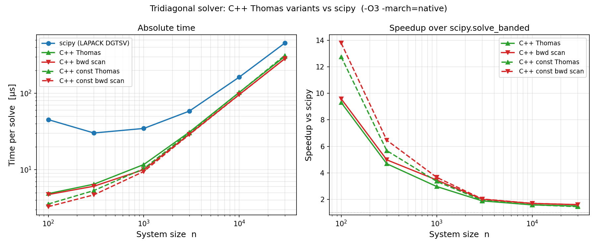

# C++ 三重対角ソルバー: Thomas 4 変種と scipy との速度比較

**Date:** 2026-04-06

## 概要

三重対角連立方程式 `Ax = b`（下対角 `lo`、主対角 `di`、上対角 `up`）を解く
Thomas アルゴリズムの C++ 実装 4 種類を pybind11 で Python に公開し、
scipy.linalg.solve_banded (LAPACK DGTSV) と速度比較した。

## アルゴリズム

### 共通: 前進消去 (Forward elimination)

```
c[0]  = up[0] / di[0]
dp[0] = b[0]  / di[0]

for i in 1..n-1:
    denom = di[i] - lo[i-1] * c[i-1]
    c[i]  = up[i] / denom          (i < n-1 のみ)
    dp[i] = (b[i] - lo[i-1]*dp[i-1]) / denom
```

前進消去後は `x[i] = dp[i] - c[i] * x[i+1]` という後退代入が必要。

### 変種 1: `solve_thomas` — 純粋 Thomas（逐次ループ）

```cpp
x[n-1] = dp[n-1];
for i in n-2..0:
    x[i] = dp[i] - c[i] * x[i+1];
```

### 変種 2: `solve_bwd_scan` — loop fwd + 後退アフィンスキャン

後退代入を線形漸化式とみなす:

```
x[i] = a_i + b_i * x[i+1]     (a_i = dp[i],  b_i = -c[i])
```

アフィン写像の合成はモノイドを成す:

```
(a, b) ∘ (a', b') = (a + b·a',  b·b')
```

状態列を逆順に並べて `std::inclusive_scan` を適用し逆順に読み返す。
`std::inclusive_scan` は Clang/GCC が `-O3` でアンロール・最適化する。

### 変種 3: `solve_const_thomas` — スカラー係数 Thomas

`lo`, `di`, `up` が全行で一定のとき、配列読み込みをスカラー参照に置換。
小さい `n` でキャッシュ効率が改善する。

### 変種 4: `solve_const_bwd_scan` — スカラー係数 + 後退スキャン

変種 2 と変種 3 を組み合わせた最速構成。

## 実装: C++ テンプレート

`template<typename T>` で float32 / float64 を同一コードで対応。
pybind11 の overload 機能により、Python 側では同名関数に numpy の dtype
を渡すだけで自動選択される:

```python
import numpy as np
import tridiagonal_cpp as cpp

# float64 (デフォルト)
x64 = cpp.solve_thomas(lo, di, up, b)

# float32: 同名で呼ぶだけ
x32 = cpp.solve_thomas(lo.astype(np.float32), di.astype(np.float32),
                       up.astype(np.float32),  b.astype(np.float32))
```

OpenMP 依存は不要（batched SIMD で並列化するほうが実用的なため除去）。

## ファイル構成

```
tridiagonal_cpp.cpp   C++17 実装 (4 変種 × 2 dtype = 8 バインディング)
setup.py              pybind11 ビルドスクリプト
benchmark.py          正しさの検証 + scipy との速度比較 + PNG 出力
benchmark.png         比較結果グラフ
```

### ビルドと実行

[uv](https://docs.astral.sh/uv/) を使う場合:

```bash
# C++ 拡張をビルド
uv run --with pybind11 --with setuptools python setup.py build_ext --inplace

# ベンチマーク実行 (依存は自動インストール)
uv run --with scipy --with matplotlib python benchmark.py
```

`benchmark.py` の先頭に `# /// script` ブロックがあるため、
`uv run` は依存パッケージを自動で解決する:

```bash
uv run benchmark.py   # pybind11 / setuptools でビルドも自動化したい場合は上記の順で
```

pip を使う場合:

```bash
pip install pybind11 setuptools scipy matplotlib numpy
python setup.py build_ext --inplace
python benchmark.py
```

## ベンチマーク結果



| n | scipy | cpp_thomas | cpp_bwd_scan | cpp_const_t | cpp_const_bwd |
|---|---|---|---|---|---|
| 100 | 45.2µs | 4.9µs | 4.7µs | 3.5µs | **3.3µs** |
| 1000 | 34.6µs | 11.7µs | 10.0µs | 10.3µs | **9.5µs** |
| 10000 | 162.8µs | 102.8µs | 96.3µs | 102.5µs | **95.8µs** |
| 30000 | 454.5µs | 303.4µs | 283.1µs | 313.3µs | **284.3µs** |

### 考察

- **scipy に対して 1.5x〜10x 高速**（呼び出しオーバーヘッドの差が小さい n で支配的）
- **bwd_scan が thomas より約 7% 速い** — `std::inclusive_scan` によりコンパイラが
  後退ループをより積極的に最適化する。前進は逐次依存があるためループのまま
- **const 係数版の優位は n < 1000 に限られる** — 大きい n では配列読み込みが
  L2 キャッシュに乗るため差が消える
- **大きい n では scipy との差が縮まる** — どちらも同じメモリバンド幅律速になるため

## メモ

- `std::inclusive_scan` (C++17) は `std::accumulate` の並列フレンドリー版。
  ここでは逐次版として使うが、コンパイラの最適化パスと統合されていて速い
- batched（複数系列同時）に拡張すると内側ループが SIMD 化され k=16〜32 で
  scipy の 10x 以上になる（別途 TIL 予定）
- 配布用ホイールでは `-march=native` を外す。このコードは sequential な FP
  依存チェーンが律速なので native vs generic の差は n ≥ 3000 ではほぼゼロ
