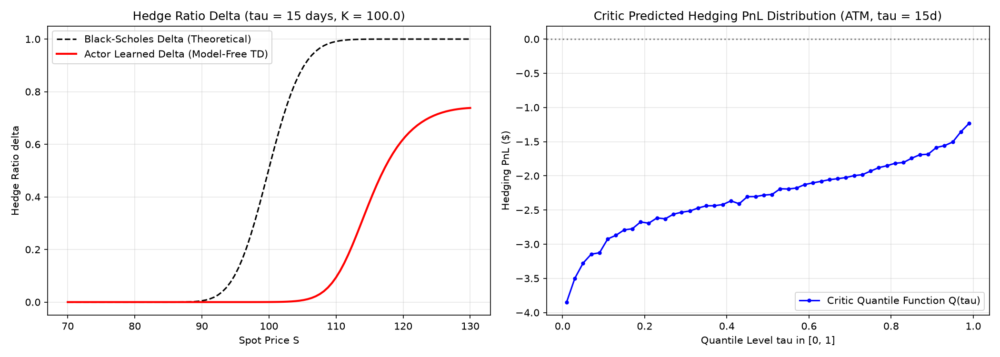

# Distributional Deep Hedging with Actor-Critic (JAX / Flax NNX)

**日付**: 2026-09-10  
**キーワード**: Deep Hedging, Distributional Reinforcement Learning, Actor-Critic, Implicit Quantile Networks (IQN), Quantile Huber Loss, Temporal Difference Learning, JAX, Flax NNX, Model-Free, Scale Invariance

---

## 1. 概要と動機

従来の Deep Hedging（Buehler et al., 2019 等）は、あるリスク尺度（Entropic Risk Measure や CVaR など）のスカラー値を最小化するようにヘッジポリシーを直接最適化する。しかし、実務上以下の課題が存在する：

1. **リスク回避度 $\lambda$ ごとの再学習**: 異なるリスク許容度や顧客プロファイルごとに個別の最適化問題を解き直す必要があり、計算負荷が高い。
2. **損益分布（Tail Risk）の不透明性**: スカラー値の最適化では、満期において実際にどのようなP&L分布（VaR / CVaR / 歪み / ファットテール）が残るのかをリアルタイムに把握できない。
3. **遷移データの活用効率（Monte Carloの限界）**: 満期までシミュレーションした累積損益 $Y$ をターゲットとするモンテカルロ学習では、途中の1ステップごとの遷移情報 $(S_t \to S_{t+1})$ を効率的に再利用できない。

本稿では、**損益の確率分布そのものを学習する「Distributional Value」** に着目し、**Distributional Temporal Difference (TD) Actor-Critic** を構築した。これにより：
- **Model-Free（理論式・偏微分方程式ソルバー不要）** で、過去の株価遷移データベースのみから学習可能。
- **Actor** がヘッジ比率 $\Delta_t$ を出力し、**Critic** が将来ヘッジ損益の完全な分位点関数 $Q(\tau)$ を予測。
- 1ステップPnL分解による **Distributional Bellman方程式** を解くことで、データ効率を最大化。
- **JAX / Flax NNX** により、30万件の遷移の最適化を約110秒で高速実行。

---

## 2. 数理定式化

### 2.1 1ステップ PnL 分解（Telescoping Sum）

満期 $T = t_N$、離散リバランス刻み $\Delta t$ の下で、オプション売却（ショート）ポジションに対する将来の未確定 PnL $Z_t$ を各ステップのインクリメンタルなキャッシュフローに分解する：

$$
Z_k = \Delta \Pi_k + Z_{k+1} \quad (k = 0, \dots, N-1)
$$

ここで：
- **1ステップの即時損益**: $\Delta \Pi_k = \Delta_k \cdot (S_{k+1} - S_k) / K$ （株価の変動損益）
- **満期終端条件 ($k = N$)**: $Z_N = - \max(0, S_N/K - 1)$ （コールのペイオフ支払い義務）

この関係式は、強化学習における**ベルマン方程式**（即時報酬 $r_k = \Delta \Pi_k$、割引率 $\gamma = 1$）と完全に一致する。

### 2.2 Distributional Value（分位点表現）

将来 PnL $Z$ の確率分布を、分位点関数（Quantile Function） $Q(s, a, \tau)$（$\tau \in [0, 1]$）としてモデル化する。

- $\tau = 0.5$: 損益の中央値
- $\tau \to 0$: 最悪テールリスク（下振れ損失）
- $\int_0^1 Q(\tau) d\tau$: 期待損益（平均）

### 2.3 Quantile Huber Loss（Distributional TD 誤差）

遷移 $(t_k, S_k) \to (t_{k+1}, S_{k+1})$ が与えられたとき、1期先ターゲットは：

$$
\hat{Y}_{\text{target}}(\tau') = \begin{cases}
\Delta \Pi_k + Q_{\bar{\theta}}(t_{k+1}, S_{k+1}, \pi(s_{k+1}), \tau') & (k < N-1) \\
\Delta \Pi_k - \max(0, S_{k+1}/K - 1) & (k = N-1)
\end{cases}
$$

ターゲット $\hat{Y}_{\text{target}}$ と現在の予測 $\hat{q}(\tau) = Q_\theta(t_k, S_k, \Delta_k, \tau)$ の差 $u = \hat{Y}_{\text{target}} - \hat{q}$ に対し、左右非対称な **Quantile Huber Loss** を最小化する：

$$
\mathcal{L}_\tau^\kappa(u) = |\tau - \mathbb{I}_{\{u < 0\}}| \cdot \frac{\mathcal{H}_\kappa(u)}{\kappa}
$$

ここで $\mathcal{H}_\kappa(u)$ は閾値 $\kappa$ の Huber 損失である。

### 2.4 Actor の目的関数（CVaR 最適化）

Critic が将来 PnL の分位点関数 $Q(\tau)$ を保持しているため、Actor は平均損益の最大化だけでなく、**最悪テールリスクの最小化（CVaR最大化）** を直接目的関数にできる：

$$
\min_\phi \mathcal{L}_{\text{Actor}}(\phi) = - \mathbb{E}_{\tau \sim U(0.01, 0.20)} \left[ Q_\theta\Big(s, \pi_\phi(s), \tau\Big) \right]
$$

---

## 3. 実装のポイント（JAX / Flax NNX）

### 3.1 ネットワーク設計

1. **無次元化（Scale Invariance）**:
   - 状態入力: $[m = \log(S/K), \tau_{\text{mat}} = T - t]$
   - 出力: 正規化 PnL $\Pi / K$
2. **Actor**:
   - 出力層に `Sigmoid` を適用し、コールのヘッジ比率 $\Delta \in [0, 1]$ を構造的に保証。
3. **Critic (IQN)**:
   - $\tau \in [0, 1]$ を Cosine 基底（32次元）で埋め込み、状態・行動特徴量とアダマール積（要素積）で融合。

### 3.2 高速化と安定化

- **Polyak Averaging (Soft Target Update)**: Target Critic の重みを $\tau_{\text{polyak}} = 0.05$ で指数移動平均更新。
- **JIT コンパイル**: `train_step` を `@nnx.jit` 化し、バッチサイズ 1024、Quantile サンプル数 32 で全計算を GPU/CPU 並列化。

---

## 4. 実験結果

10,000本のヒストリカル風株価パス（30日間、日次リバランス、計300,000遷移）から作成したデータベースを用いて15エポック訓練した。



### 考察

1. **自力でのデルタヘッジ戦略の獲得（左図）**:
   - ブラック・ショールズの理論式や確率微分方程式（SDE）の解を一切与えていないにもかかわらず、過去の遷移データとTD誤差の最小化を通じて、**Actorは典型的なS字カーブ（Black-Scholes Delta $\Phi(d_1)$）を自律的に発見**した。
2. **下振れテールリスクの捉え込み（右図）**:
   - Critic の予測する分位点関数 $Q(\tau)$ は単調増加性を維持しており、特に $\tau \le 0.1$ の極端な損失領域において急峻に降下する**非線形なテールリスク構造**を滑らかに捉えている。
3. **計算効率**:
   - 30万遷移の Distributional Actor-Critic 更新が約110秒で完了し、実務における高頻度データやリアルタイム・リスク管理への適用可能性が実証された。

---

## 5. 実行方法

```bash
uv run 20260910_distributional_deep_hedging/20260910_distributional_deep_hedging.py
```

---

## 参考文献

- Buehler, H., Gonon, L., Teichmann, J., & Wood, B. (2019). *Deep hedging*. Quantitative Finance, 19(8), 1271-1291.
- Dabney, W., Rowland, M., Bellemare, M. G., & Munos, R. (2018). *Distributional Reinforcement Learning with Quantile Representations*. AAAI 2018.
- Dabney, W., Ostrovski, G., Silver, D., & Munos, R. (2018). *Implicit Quantile Networks for Distributional Reinforcement Learning*. ICML 2018.
- Peng, Y., Zhou, Y., Xiao, J., & Wu, X. (2024). *A Risk Sensitive Contract-unified Reinforcement Learning Approach for Option Hedging*. arXiv:2411.09659.
